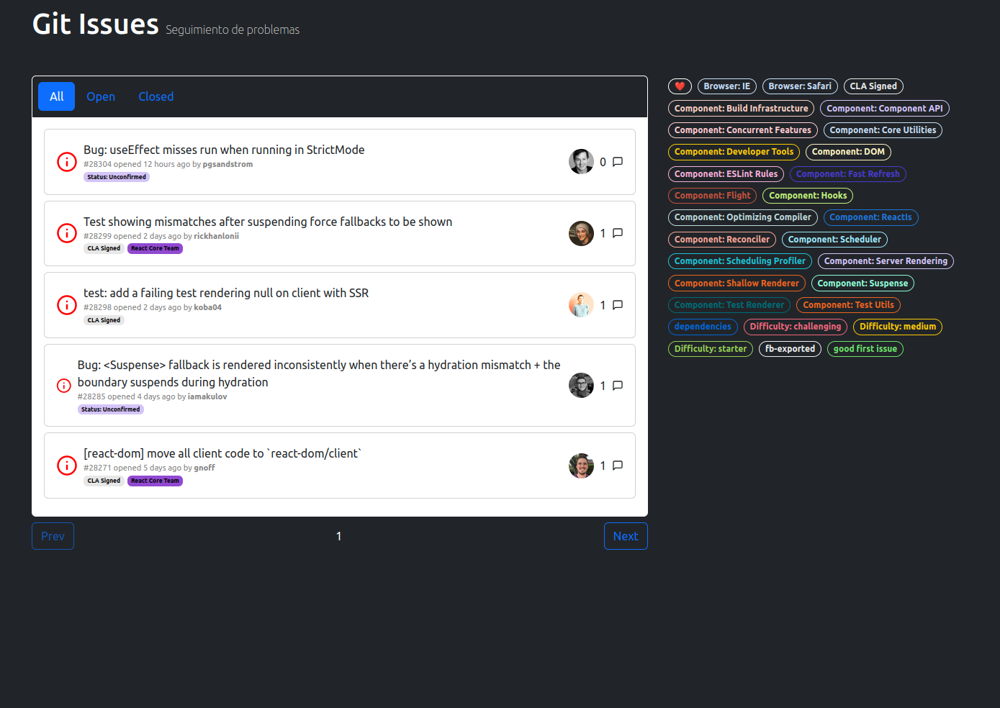
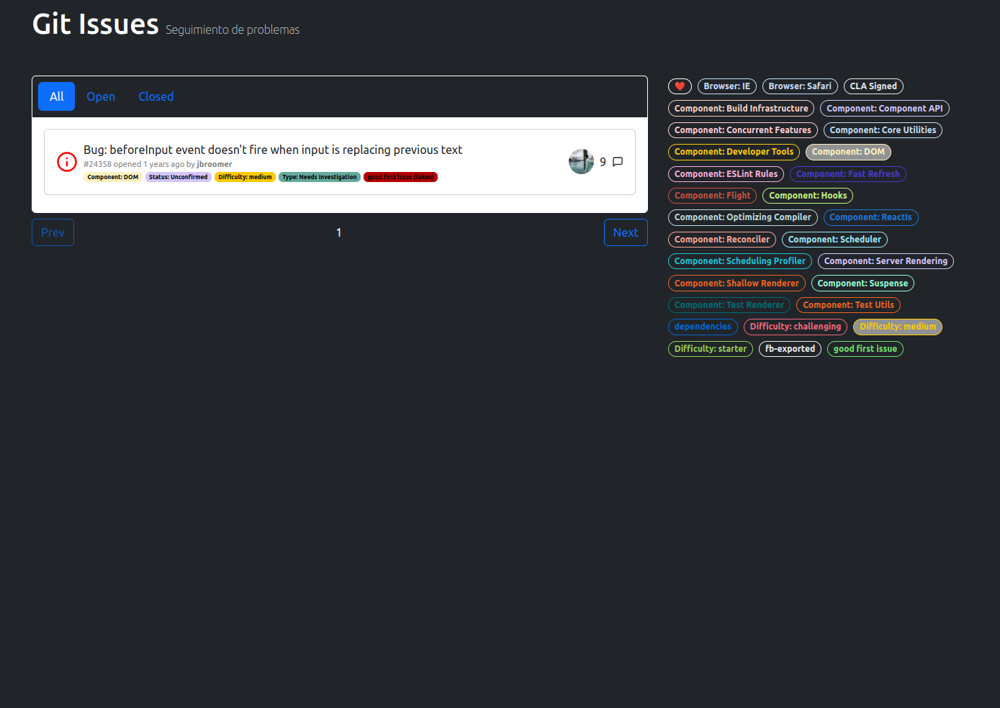
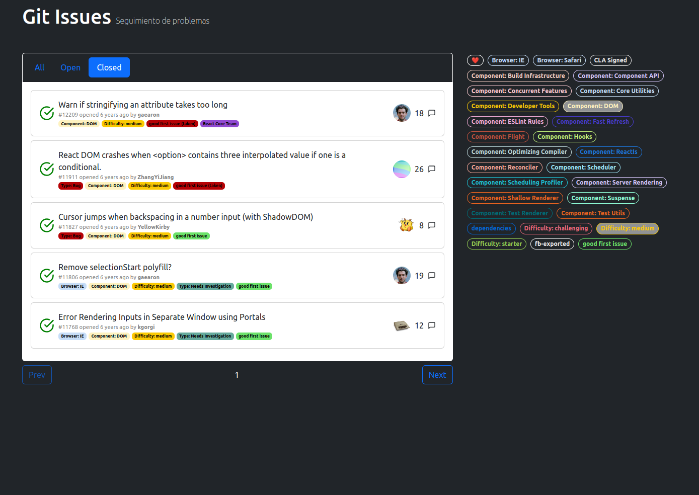
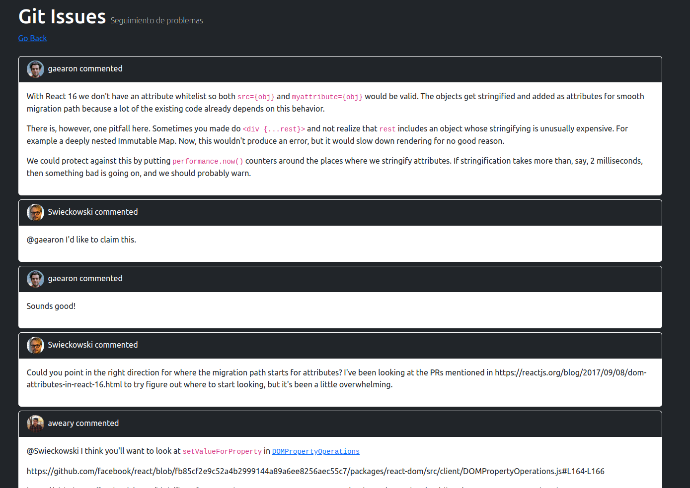

# React Query Issues

This is a repository designed to explore React Query fundamentals. It fetches GitHub issues from the Facebook repository, showcasing them on-screen with filterable navigation and detailed views. Leveraging prefetchQuery and setQueryData for cache updates, it efficiently manages complex object state while supporting pagination and infinite scroll for enhanced user experience. Ideal for mastering React Query's advanced data management capabilities.

*The project implements a helper called sleep(), which is used to simulate a delay in the API response. This is useful for testing the loading state of the application. By default, the delay is set to 2 second. The idea behind this is to simulate a real-world scenario where the API response takes a while to return, and show how the application use the cache to display the "fresh" data while the new data is being fetched (if the cache is stale).*

## Installation

1. Clone the repository
2. Complete the .env file with your GitHub API token (Settings > Developer settings > Personal access tokens > Fine-grained tokens)
3. Run `yarn install` to install the dependencies (or `npm install` if you prefer npm)
4. Run `yarn start` to start the development server (or `npm run dev` if you prefer npm)

## Images

